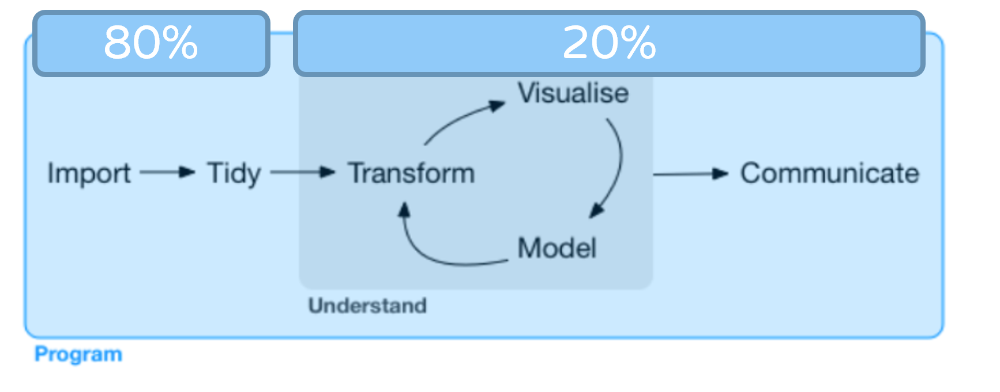
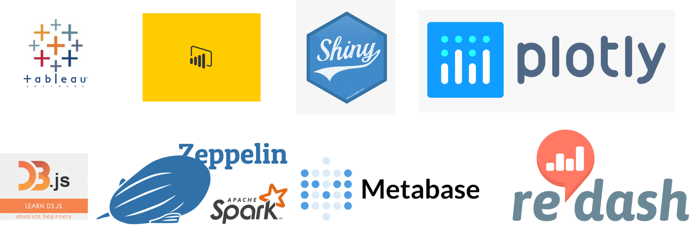
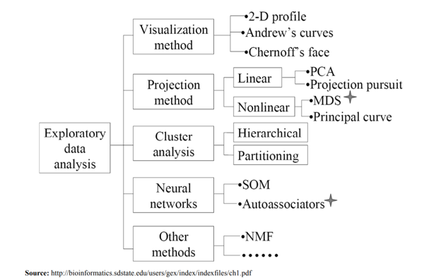

# 課程內容

成績：
  * 點名 : 20% 
  * 平時: 10%
  * 期中 (上機考): 30%
  * 期末 (上台報告): 40%

課程內容 :
Lunix、VM、Crawler、Text Mining(NLP)、R、Python

---
# All about Data

Open Data：
任何人可以取得的公開資訊

* 一般而言：通常由政府單位提供的結構或非結構資訊
 ex:內政部地理資訊系統(提供經緯度與地址互轉)、商業司(公司行號的公開資訊)
Issue:正確性?一致性? 可用性?

* 廣義：網路上任何使用者『看』的到的資訊
Issue:使用的界線?規範?

---
# All about Data

探索：Crawler -> 爬蟲
常需客製化處理、每次的主題、網站型態改變，或經過網站改版，就須更改程式。

應用：Analysis or Visualization or Mining

---

# Viz. Tools

---
# EDA(Exploratory Data Analysis)

* Tukey『統計應該是科學，而非數學』
* 主張數學的假設，需要Data加以驗整才可行。
* Goal：Get a general sense of the data
  - You should always look at every variable
* 通常會考慮交互作用跟視覺化
  - 檢測異常值
  - 測試假設
  - 識別有用的欄位(快速了解是否需要轉換) ex box-cox 

---
# EDA(Exploratory Data Analysis)

.center[]

---

# EDA(Exploratory Data Analysis)
* 分類問題：
	- 問題→數據→模型→分析→結論
* EDA：
	- 問題→數據→分析→模型→結論
* 貝氏：
	- 問題→數據→模型→先驗分佈→分析→結論

---
#期末報告
* 請先事先準備:
  - 人數：1~2人
  - 時間:7~10 Mins 
  - 主題：某新聞網站的某主題去分析(運動、籃球、政治…)、PTT某主題、政府網站的公開資訊

---
# 期末報告 Hint
* 可能的步驟：
  - Step 1：定義主題
    定義主題後想要解決的問題(可測量)
  - Step 2：收集資料(Crawler)
  - Step 3：了解手上的資訊(資料整理、EDA)
  - Step 4：需要進行特徵工程嗎? (Missing Data、正規化、新變數…)
  - Step 5：決定演算法(分類、分群)
  - Step 6：優化模型
  - Step 7：結論(有沒有回答道自己定義的問題、是否有可能有不同的結論、你的結論是不是有限制

---
#期末報告Example
* Step 1：台北市市長候選人聲量分析(定義主題)
* Step 2：PPT八卦版、三立新聞、TVBS新聞... 收集資料(Crawler)
* Step 3：Simple Chart、data clean ... 了解手上的資訊(資料整理、EDA)
* Step 4：將每篇文章貼上tag、取出每篇文章的關鍵詞、代表詞、將文字資料整理成DTM或是任何協助你解決問題的資料...  需要進行特徵工程嗎? (Missing Data、正規化、新變數…)
* Step 5：決定輿情分析的計分模式、計算每篇文章的聲量，決定演算法(分類、分群)
* Step 6：解讀初步資訊，判斷是否需要再進行優化，需要的話重複step3... 優化模型
* Step 7：結論(有沒有回答道自己定義的問題、是否有可能有不同的結論、你的結論是不是有限制

---
class: inverse, center, middle
# 慎選組員

